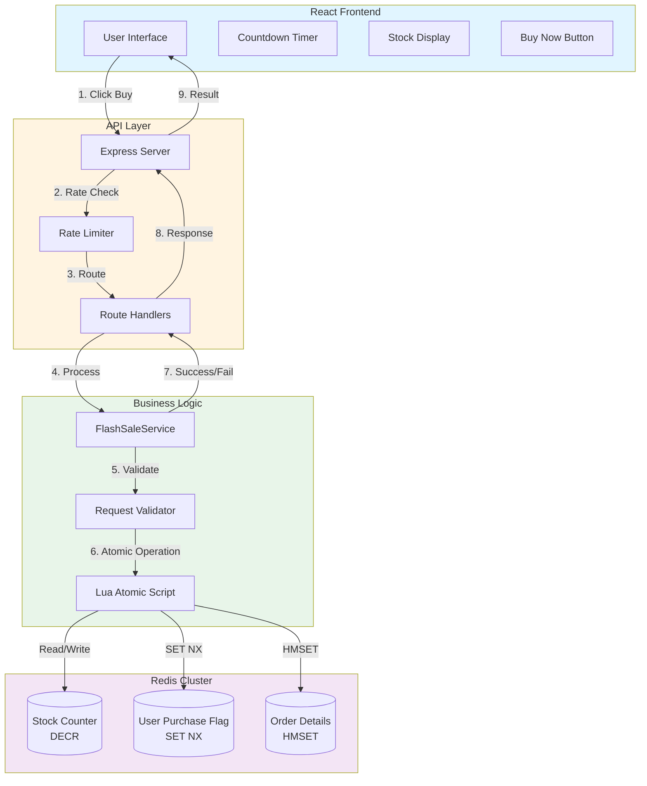
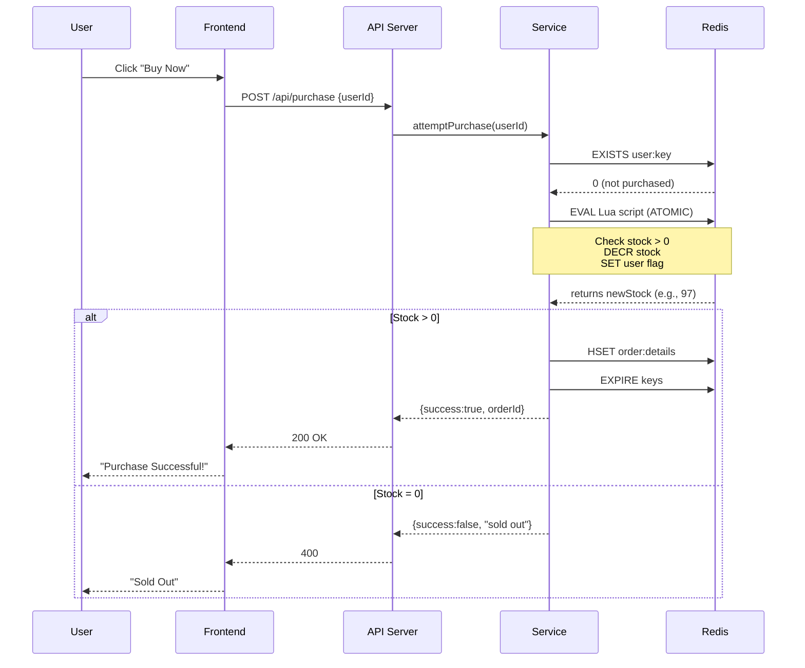
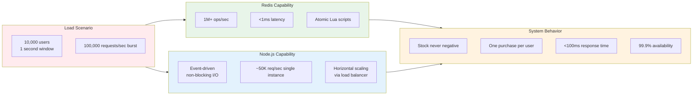
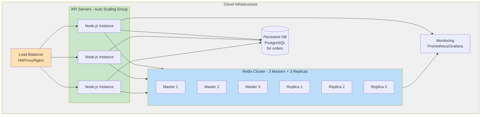

## Request Flow with Concurrency Control



## System Scale & Capacity



## Deployment Architecture (Production)



## Failure Scenarios & Mitigation

```mermaid
graph TD
    A[Failure Scenario] --> B1[Redis Down]
    A --> B2[API Crash]
    A --> B3[Network Partition]
    A --> B4[Traffic Spike]

    B1 --> C1[Mitigation: <br/>Redis Sentinel/Cluster<br/>Failover automatic]
    B2 --> C2[Mitigation: <br/>Process manager (PM2)<br/>Auto-restart<br/>Multiple instances]
    B3 --> C3[Mitigation: <br/>Circuit breaker pattern<br/>Graceful degradation]
    B4 --> C4[Mitigation: <br/>Rate limiting<br/>Queue (Redis Streams)<br/>Auto-scaling]

    C1 --> D[✓ Maintains consistency]
    C2 --> D
    C3 --> D
    C4 --> D

    style B1 fill:#ffcdd2
    style B2 fill:#ffcdd2
    style B3 fill:#ffcdd2
    style B4 fill:#ffcdd2
    style C1 fill:#c8e6c9
    style C2 fill:#c8e6c9
    style C3 fill:#c8e6c9
    style C4 fill:#c8e6c9
```
